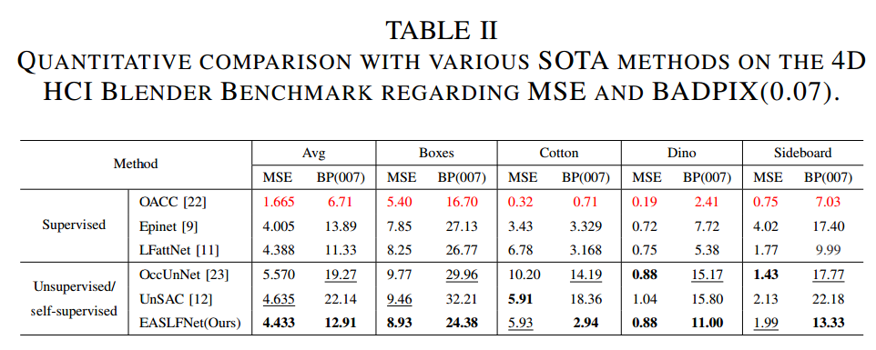

<h1> Edge-aware Self-supervised Light Field Depth Estimation with Semantics Guided and Cross-View-Task Correlation </h1>

## 👀Introduction

Due to the rich spatial and angular information inherent in light field images, they offer significant advantages for a variety of applications, with depth estimation being a prominent example. To mitigate the reliance on ground truth in supervised learning-based approaches, considerable efforts have been directed toward unsupervised and self-supervised methods. However, many of these approaches are limited by their reliance on photometric consistency, particularly in regions with weak textures and at object boundaries. To address this challenge, we propose the Edge-aware Self-supervised Light Field Depth Estimation Network (ESLFDE-Net), aimed at leveraging crossdomain information—particularly scene semantics—to enhance light field depth estimation. This network integrates implicit semantic knowledge into the refinement of geometric representations and introduces two distinct strategies to extract complementary information from surrounding views for inferring discrepancies in the central view. The first strategy, light field view correlation complementarity, employs self-attention and crossattention mechanisms to extract multi-scale angular information from the light field and enhance feature fusion. The second strategy, semantic-guided feature integration, utilizes a novel Cross-task Feature Interaction Attention Module to enhance the semantic consistency of depth information representation. Extensive evaluations on three widely used datasets demonstrate the superior performance of the proposed ESLFDE-Net.

## 📈Results

## 📈Experiment

the training and inference code will be fully released after acceptance.
